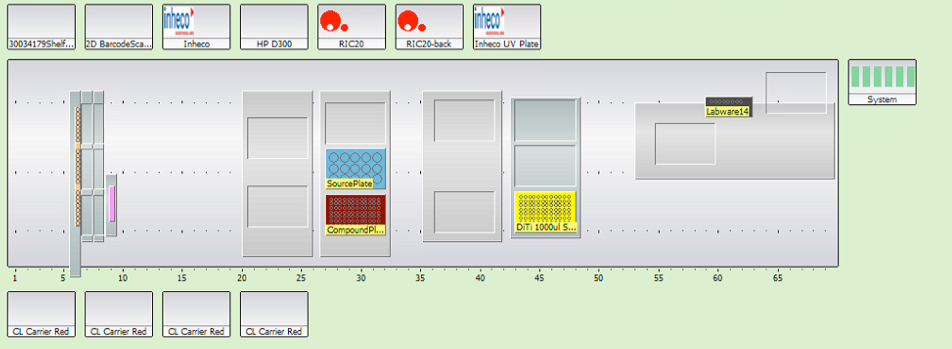

#A simple protocol to create 10mM DMSO stock plates.

This protocol fills 4ti0110 plates with 10mM DMSO stocks.  

## Relevant Scripts
- Momentum Process: WIP_JDC_PrepareCompoundStockPlates_4ti0110
- Momentum Experiment: E_WIP_JDC_PrepareCompoundStockPlates_4ti0110
- EVO Scripts: WIP_LRL_CreateCompoundStockPlates_05oct2015.esc

## Procedure
