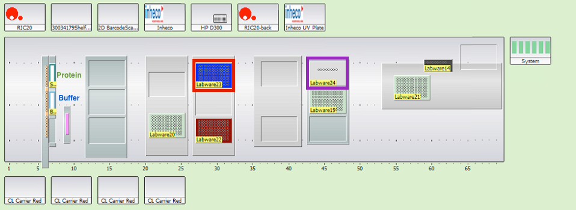

This protocol fills one plate with alternating rows of Protein in Buffer (1 uM of kinase) and just Buffer. Each well is 100 uL and dispensed using single pipetting into 96 well plates. Four different ligands are then added in a half log dilution starting from 20 uM using the D300. The plate then gets shaken to mix, centrifuged and the fluorescence read.

## Relevant Scripts 
- Momentum Process: EXP_FLU_Spectra
- Momentum Experiment: E_EXP_FLU_Spectra
- EVO Scripts: EXP_FLU_Spectra_a_b.esc, EXP_FLU_Spectra_c_d.esc, EXP_FLU_Spectra_e_f.esc and EXP_FLU_Spectra_g_h.esc
- D300 Scripts: EXP_FLU_Spectra_a_b.DATA.xml, EXP_FLU_Spectra_c_d.DATA.xml, EXP_FLU_Spectra_e_f.DATA.xml and EXP_FLU_Spectra_g_h.DATA.xml 
- Infinite Script: EXP_FLU_Spectra_a_b_rows.mdfx, EXP_FLU_Spectra_c_d.mdfx, EXP_FLU_Spectra_e_f.mdfx and EXP_FLU_Spectra_g_h.mdfx

## Procedure
- If needed make compound stock plate as described [here](https://github.com/choderalab/wetlab-protocols/blob/updates/Compound_Stock_Plate_Preparation/Compound_Stock_Plate_Preparation.md).
- Prepare 7 mL of 1 µM kinase in Kinase Buffer (in fridge).
- Use tube from -80ºC.
- Spin down (5000 rcf for 10 min at 4C).
- Measure concentration using denovix (most proteins we use should be preprogrammed).
- Calculate appropriate amount to get 1 uM in total 7 mL using `protein_volume_calculation.py` [here](https://github.com/choderalab/wetlab-protocols/blob/updates/Frequent_calculations_during_experiment_preparation/WIP_python_scripts/protein_volume_calculation.py).
- Run maintenance scripts: MAINT_Wash and MAINT_Rehome on EVO.
- Load Kinase Buffer into 100 mL trough, Protein into 25 mL trough, fresh D300 chip (Purple rectangle), 200 uL SBS DiTis (red rectangle) and appropriate Compound Stock Plate (Green rectangle).

- Set DiTi position on EVOware.
- Set the compound stock plate aspiration position on EVOware (Step 16 on EVOware scripts). 
- Place 1 clean 4ti_0234 (96 well, clear) plate in Stack 4 of cytomat (Nest 1).
- Make sure to name the four infinite output files accordingly.
- Run Momentum Script. E_EXP_FLU_Spectra
- Infinite results file will be output to Google Drive (choderalab/automation/protocols/infinite/results).
- Using assaytools run xml2png4scans-spectra.py on output xml files.

## Former scripts that perform the same function:
- Momentum Process: WIP_LRL_FLU_Spectra
- Momentum Experiment: E_WIP_LRL_FLU_Spectra
- EVO Scripts: WIP_LRL_FLU_Spectra_a_b_rows_diff_carrier.esc, WIP_LRL_FLU_Spectra_c_d_rows_diff_carrier.esc, WIP_LRL_FLU_Spectra_e_f_rows_diff_carrier.esc and WIP_LRL_FLU_Spectra_g_h_rows_diff_carrier.esc
- D300 Scripts: LRL_Src_Bos_2rows_1_2 2015-09-11 1048.DATA.xml, LRL_Src_Bos_2rows_3_4 2015-09-15 1029.DATA.xml, LRL_Src_Bos_2rows_5_6 2015-09-15 1030.DATA.xml and LRL_Src_Bos_2rows_5_6 2015-09-15 1030.DATA.xml and LRL_Src_Bos_2rows_7_8 2015-09-15 1031.DATA.xml - Infinite Script: EXP_FLU_Spectra_a_b_rows_4ti0234-bw2020_2gains.mdfx, EXP_FLU_Spectra_c_d_rows_4ti0234-bw2020_2gains.mdfx, EXP_FLU_Spectra_e_f_rows_4ti0234-bw2020_2gains.mdfx and EXP_FLU_Spectra_g_h_rows_4ti0234-bw2020_2gains.mdfx

### Kinase Buffer Instructions (if needed)

USE THE REVO. Otherwise:

To make 2L of 20 mM Tris 0.5 mM TCEP pH 8:

#### Materials:
- TCEP: Biosynth C1818 Lot 0000009688 MW 286.65 g/mol
- 1M Tris pH 8: Fisher Bioreagents BP1758-500 Lot 135742
- 1L graduated cylinder
- 2 x 2L glass beaker

#### Preparation:
- add 40 mL of 1M Tris pH 8 to graduated cylinder
- add 286.65 mg TCEP to graduated cylinder [actual: 288.2 mg]
- fill up cylinder to 2L with ddH2O (Purelab Ultra)
- add stir bar to graduated cylinder and stir to dissolve TCEP
- transfer everything to 2L glass beaker on stir plate and adjust pH to pH 8 by titration with conc HCl or NaOH [initial pH was ~7.81; final pH was 7.99 after adding 10% NaOH dropwise]
- filter into sterile container
