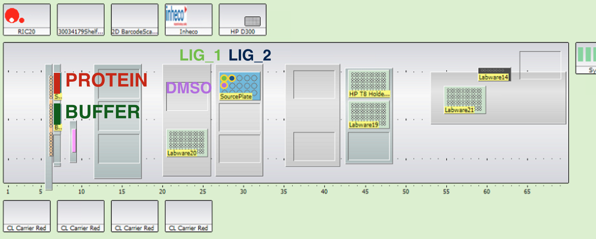

#A simple experiment to get saturation binding curves from fluorescent kinase inhibitors.

This protocol fills two plates with alternating rows of Protein in Buffer (usually 0.5 uM Src) and just Buffer. 
Each well is 100 uL and dispensed using single pipetting in two 96 well plates. Ligand is then added to both 
plates in a half log dilution starting from 20 uM using the D300. Results are gathered for two ligands 
simultaneously: the ligand names are defined as variables in Momentum before the script is run.

The plates then get shaken to mix, centrifuged and the fluorescence read. 

## Relavent Scripts
- Momentum Process: EXP_FLU_Kinase_Inhibitors_1
- Momentum Experiment: E_EXP_FLU_Kinase_Inhibitors_1
- EVO Scrtips: EXP_FLU_Kinase_Inhibitors_1_Lig1 and EXP_FLU_Kinase_Inhibitors_1_Lig2
- D300 Scripts: Src_Bos_96well_Nov2014_well12.DATA.xml and Src_Bos_96well_Nov2014_well34.DATA.xml
- Infinite Script: EXP_FLU_Kinase_Inhibitors_1  

## Procedure
- Prepare 14 mL of 0.5 µM Src (9.6 should be enough for two experiments, but good to have over).
 - Use tube from either -80ºC or 4ºC.
 - Spin down (5000 rcf for 10 min at 4C).
 - Measure concentration using denovix (Src should be preprogrammed).
 - Convert to moles
 - Add appropriate amount to total 14 mL.
- Run maintenance scripts on EVO.
- Load Buffer, Protein, fresh D300 chip, DMSO, Ligand_1 (in this case Gefitinib), and Ligand_2 (in this case Erlotinib) according to the image below.

- Place 2 clean 4ti_0223 (96 well, black clear bottom) plates in Stack 4 of cytomat.
- Run Momentum Script. Make sure you have defined right ligand names as variables.
- Infinite results file will be output to google drive.
- Using assaytools run xml2png on output xml files. 

