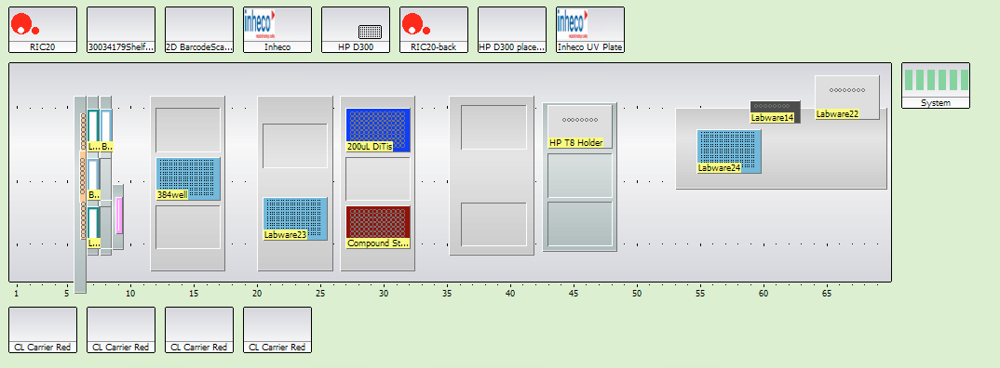

We have three standard EVO deck layouts, they are all very similar. The only difference is what is on grid 12:
 - Layout 1 : `MP 3Pos 2015` on grid 12 
 - Layout 2 : `DiTi 3Pos` for hanging tips on grid 12  
 - Layout 3 : `Te-VacS` for vacuum filtration on grid 11

Working examples that use these layouts are saved as worktable-only templates in EVOware:

 - `Chodera_Template_1_MP3Pos`
 - `Chodera_Template_2_HangingTips`
 - `Chodera_Template_3_Vacuum`

If you select `New` to make a new script in EVOware, these templates should pop up as options.

A couple things to note about carriers and containers:

 - 1 mL tip boxes can only go on the flat MP3Pos, otherwise the LiHa2 (with fixed tips) will hit it.
 - Be careful where you put the vial holders and the eppendorf tube holder, as the  RoMa can run into when it is moving plates to the Inheco's if this is not done with careful planning.

Picture:

Screencap:

